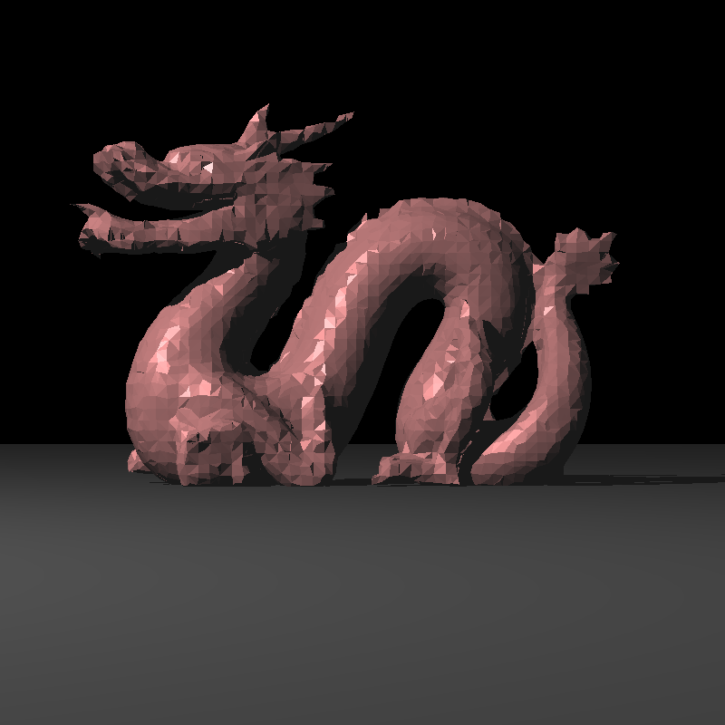

# Yet Another Go Ray Tracer (yagrt)
This is a CPU ray tracer written purely in Golang.

:white_check_mark: Sphere and Triangle Intersections  
:white_check_mark: Point Lights  
:white_check_mark: Ambient, Diffuse and Specular Shading  
:white_check_mark: Shadows  

TODO:
- Acceleration structures (Possibly BVH)
- Reflection and Refraction
- Many other Light types
- Depth of Field
- Obj and Stl support

This is a WIP
